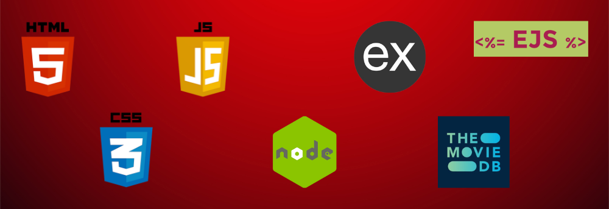
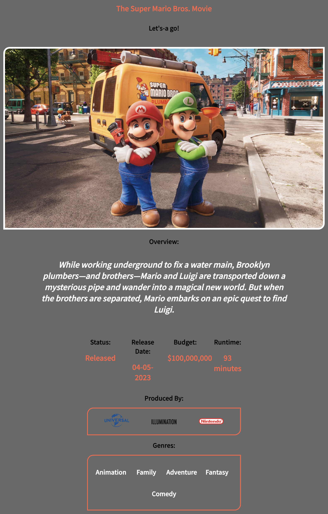

### Date: 5/24/2023

#### By: Michael Lackey

#### [Website](https://michaellackey.com/) | [GitHub](https://github.com/NobodysLackey) | [LinkedIn](https://www.linkedin.com/in/michaelglackey/)
***

### ***Description***

##### An example website to showcase to students how to interact with an external API using a Node/Express/EJS site.
***

### ***Technologies Used***

***

### ***Getting Started***

##### Use the navbar to navigate to the Search section where popular results will automatically populate. You can then search for a movie or click on one to see more details.

***

### ***Screenshots***

  <pre>
    &nbsp;&nbsp;&nbsp;
  </pre>

***

### ***Future Updates***

- [ ] Make the app scale for multiple sized screens
- [ ] Improve landing page
***

### ***Credits***

##### TMDB API: [TMDB](https://www.themoviedb.org/)

***
